# Tarea 3 - Backend de la Práctica 2

## 📱 Descripción General

Esta es una aplicación completa de autenticación (Login/Registro) desarrollada con **Android (Kotlin)** en el frontend y **Node.js/Express** en el backend. La aplicación demuestra la integración entre una aplicación móvil y una API REST.

---

## 🚀 Instrucciones de Uso

### Prerrequisitos

#### Backend

- Node.js v18 o superior
- npm o yarn
- Docker (recomendado)

#### Frontend

- Android Studio Giraffe o superior
- SDK de Android 23 o superior
- Emulador de Android Studio (recomendado)

---

## 📖 Guía de Configuración

### 📌 1. Configurar y Ejecutar el Backend

> **ℹ️ IMPORTANTE**: Para instrucciones completas y detalladas sobre cómo implementar el backend, consulta el archivo **[Backend-Nodejs-Express/README.md](Backend-Nodejs-Express/README.md)**. Ese documento contiene toda la información técnica, configuración y más.

### 2. Configurar y ejecutar el Frontend

> **ℹ️ IMPORTANTE**: Esta aplicación está configurada específicamente para funcionar con el **emulador de Android Studio**.

#### Emulador de Android Studio

1. Abre Android Studio
2. Abre el proyecto desde `Android/`
3. Abre AVD Manager (Herramientas → Device Manager)
4. Selecciona un dispositivo virtual (o crea uno nuevo)
5. Inicia el emulador
6. En Android Studio, haz clic en "Run" o presiona `Shift + F10`

**Nota**: El código utiliza `http://10.0.2.2:5000` que es la dirección especial para acceder a localhost desde el emulador de Android Studio.

#### ⚠️ Para usar en un teléfono real

Si deseas ejecutar la aplicación en un teléfono real, debes cambiar la dirección de la API en los siguientes archivos:

**Archivos a modificar**:

- [Android/app/src/main/java/com/example/tarea3/MainActivity.kt](Android/app/src/main/java/com/example/tarea3/MainActivity.kt#L51)
- [Android/app/src/main/java/com/example/tarea3/LoginActivity.kt](Android/app/src/main/java/com/example/tarea3/LoginActivity.kt#L60)
- [Android/app/src/main/java/com/example/tarea3/RegisterActivity.kt](Android/app/src/main/java/com/example/tarea3/RegisterActivity.kt#L60)

**Cambiar de**:

```kotlin
.baseUrl("http://10.0.2.2:5000")
```

**a** (reemplaza `IP_DE_TU_PC` con tu dirección IP real):

```kotlin
.baseUrl("http://IP_DE_TU_PC:5000")
```

Ejemplo: `http://192.168.1.100:5000`

---

## 🛠️ Tecnologías Utilizadas

### Backend

- **Node.js** - Runtime de JavaScript
- **Express.js** - Framework web
- **SQLite3** - Base de datos
- **bcryptjs** - Encriptación de contraseñas
- **CORS** - Habilitación de solicitudes cruzadas
- **body-parser** - Parseo de JSON

### Frontend

- **Kotlin** - Lenguaje de programación
- **Android SDK** - Framework nativo
- **Retrofit2** - Cliente HTTP REST
- **Coroutines** - Programación asincrónica
- **Material Design** - Diseño de interfaz

---

## 📱 Ejercicios desarrollados

### 1. Conexión y verificación de la API - `MainActivity`

- **Propósito**: Prueba inicial de conexión a la API
- **Funcionalidad**: Realiza una solicitud GET a `/` para verificar que el servidor está activo. El mensaje de resuesta se muestra en un `TextView`
- **Navegación**: Botones para ir a Login o Registro

<details>
<summary>📸 Ver captura </summary>

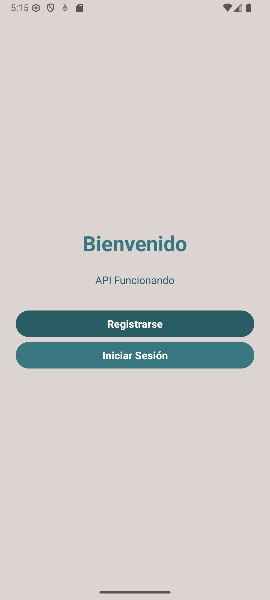

_Pantalla inicial con mensaje de la API_

</details>

### 2. Pantalla de Registro - `RegisterActivity`

- **Propósito**: Registro de nuevos usuarios
- **Funcionalidad**:
   - Validación de campos vacíos
   - Realiza una petición POST enviando datos a `/register`
   - Manejo de errores (usuario duplicado, etc.)
   - Mensaje de éxito con limpieza de campos

<details>
<summary>📸 Ver capturas </summary>

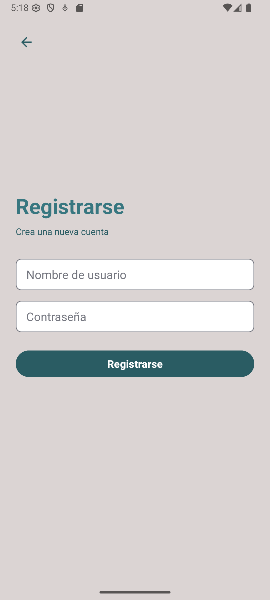

_Formulario de registro con campos de nombre del usuario y contraseña_

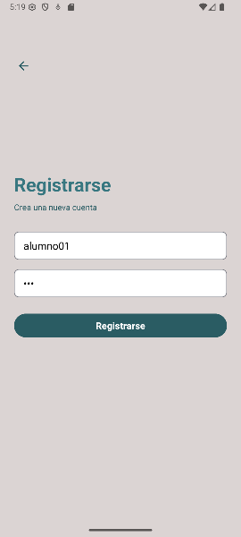

_Usuario completando el proceso de registro_

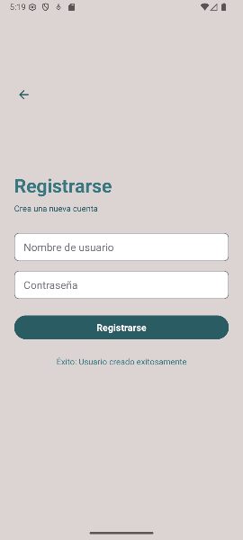

_Mensaje de confirmación tras registro exitoso_

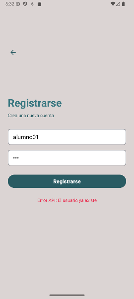

_Error al intentar registrar un nombre de usuario ya existente_

</details>

### 3. Pantalla de Login - `LoginActivity`

- **Propósito**: Autenticación de usuarios existentes
- **Funcionalidad**:
   - Validación de credenciales
   - Realiza una petición POST enviando datos a `/login`
   - Navegación a `WelcomeActivity` si es exitoso
      - Pantalla de bienvenida tras login exitoso
      - Muestra el nombre del usuario autenticado
      - Agrega un botón para cerrar sesión
   - Manejo de errores (credenciales inválidas, conexión, etc.)

<details>
<summary>📸 Ver capturas </summary>

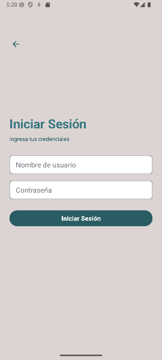

_Formulario de login con campos de credenciales_

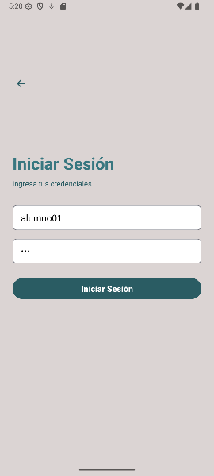

_Usuario ingresando sus credenciales_

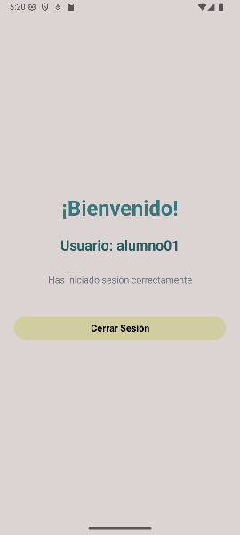

_Pantalla de bienvenida mostrando el nombre del usuario autenticado_

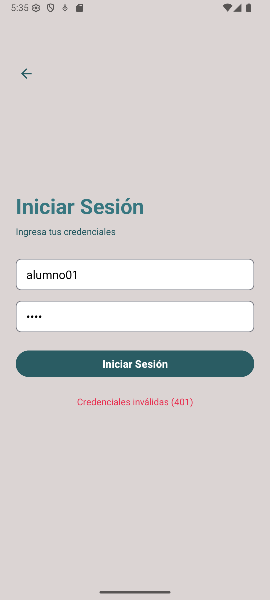

_Error al intentar iniciar sesión con credenciales inválidas_

</details>

### 4. Manejo de errores de red

#### ⏳ Indicador de Carga (ProgressBar)

Todos los Activities de la aplicación cuentan con un **ProgressBar** que se muestra durante las peticiones a la API

#### ⚠️ Manejo de Timeouts y Errores

Si la petición a la API **se tarda demasiado** o **falla la conexión**:

- El ProgressBar se oculta automáticamente
- Se muestra un **mensaje de error de conexión** al usuario
- El mensaje indica la razón específica del fallo (timeout, conexión rechazada, servidor no disponible, etc.)
- El usuario puede reintentar la operación

<details>
<summary>📸 Ver capturas </summary>

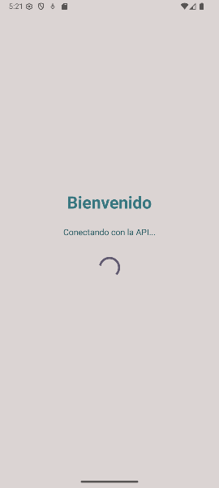

_Indicador de carga durante la verificación inicial_

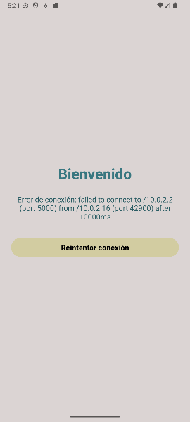

_Error de conexión al verificar la API_

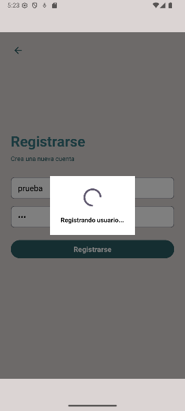

_Indicador de carga durante el proceso de registro_

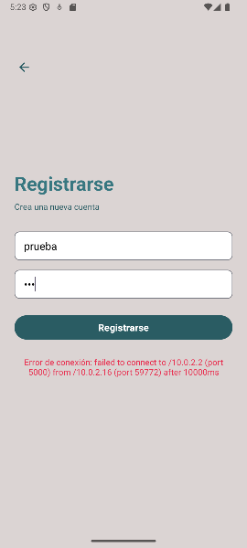

_Error de conexión durante el registro_

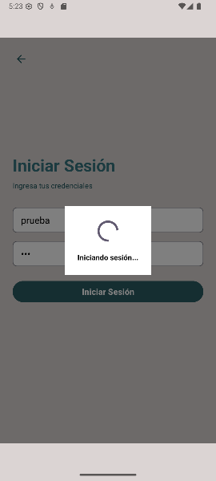

_Indicador de carga durante el proceso de login_

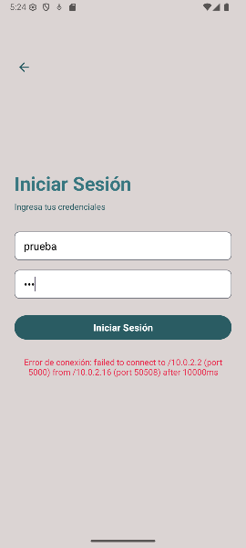

_Error de conexión durante el login_

</details>
